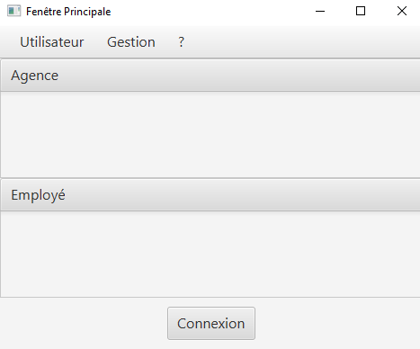
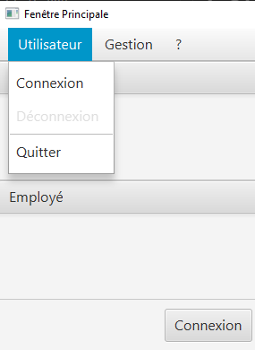
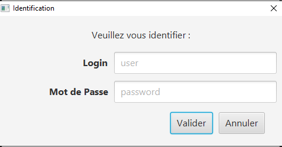

:toc:
:toc-title: Sommaire

= Documentation utilisateur V1

image::../img/Logo_IUT_Blagnac.png[Logo IUT, 100,50]

== Présentation générale de l'application 

L'application DailyBank est un outil de banque en ligne qui est déjà existant mais qui est maintenant obsolète c'est pour cela qu'une nouvelle version de cette application est en développement avec des ajouts de fonctionnalités ainsi que des amélioration de l'expérience utilisateur tel que l'ergonomie, la fiabilité et que l'application soit sûre.

== Rôle de l'application 

L'application de banque en ligne DailyBank est la jonction entre l'utilisateur et la banque pour ce faire elle doit permettre une communication fluide sans friction et simple d'utilisation pour les clients ainsi que pour les employés de la banque 

== Installation utilisation 

L'utilisation d'une application se doit simple c'est pour cela que l'application DailyBank est installable en quelques étapes seulement.

Il suffit à l'utilisateur de se rendre sur le site de la banque DailyBank, il devra ensuite se rendre sur la section Téléchargement et télécharger le fichier DailyBank.jar.

Une fois téléchargé le fichier peut être ouvert et de là, l'utilisateur n'a qu'a se connecté est accède directement à l'application.

== Fonctionnement

Au lancement de l'application l'utilisateur arrive sur la page principale, il ne peut rient faire a par se connecter, voir la fênetre d'aide ou quitter l'application.

Pour se connecter, l'utilisateur devra appuyer sur le bouton connexion ou dans la barre de menu l'option connnexion. Une fois le bon nom d'utilisateur et le bon mot de passe rentrés l'utilisateur se connectera à son compte.

Une fois connecté, l'utilisateur pourra voir les information sur son agence bancaire ainsi que ses employés, Une option dans le menu Gestion sera dégrisée ainsi que l'option de se déconnecter

image::../img/fenetre_principale_application_connecté.png[fenetre identification,300,200]

Dans le menu de gestion, l'utilisateur est confronté à plusieurs option, il peut tout d'abord retourner à la fenêtre d'accueil, il peut rechercher des client grâce à leurs numéro, nom ou prénom. Une fois un client séléctionné il est possible de voir l'historique des transactions d'un compte client, ou alors on peut modifier les informations du client. l'utilisateur peut également créer un nouveau client, il devra remplir les zones de textes appropriées pour renseigner un nouveau client.

== Résultats produits avec jeux d'essai commentés 