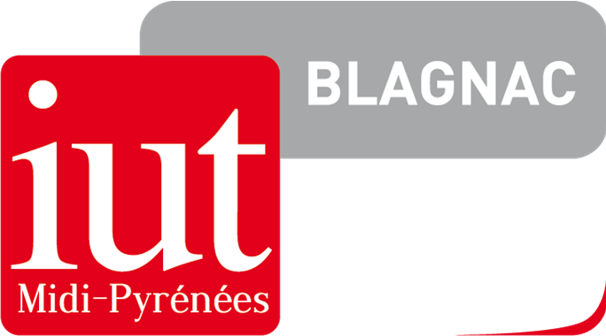

= Documentation technique V1
:toc:
:toc-title: Sommaire

Project by:

    Adriel Marchant
    Elvis Pichou
    Marco Valle

== Présentation de l'application

Dans un contexte de digitalisation des banques françaises, nous sommes chargés de la refonte de l'application "Daily Bank" permettant de gagner en rapidité pour les guichetiers afin de répondre aux exigences client en terme d'instatanéité. 

== Architecture

L'architecture de l'application fonctionne sur le principe Modèle-Vue-Contrôleur.

Modèle: Base de données SQL Oracle

Vue: IHM réalisée en JavaFX

Contrôleur: Code Java permettant les intéractions entre la vue et le modèle.

== Diagramme Use Case de la V0

image::img/UC-V0.png[Logo IUT, 200,200]

== Fonctionnalités

Dans la version exisante de l'application, il est possible pour un guichetier de:

* Modifier les informations d'un client (adresse, téléphone)

* Créer un nouveau client

* Consulter un compte

* Débiter un compte 

Dans la version exisante de l'application, il est possible pour un chef d'agence de:

* Rendre innactif un client