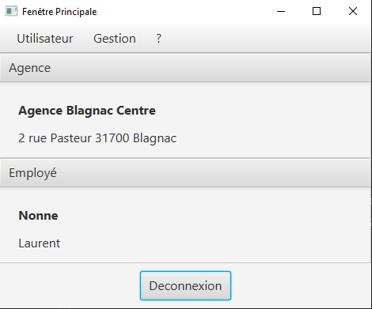
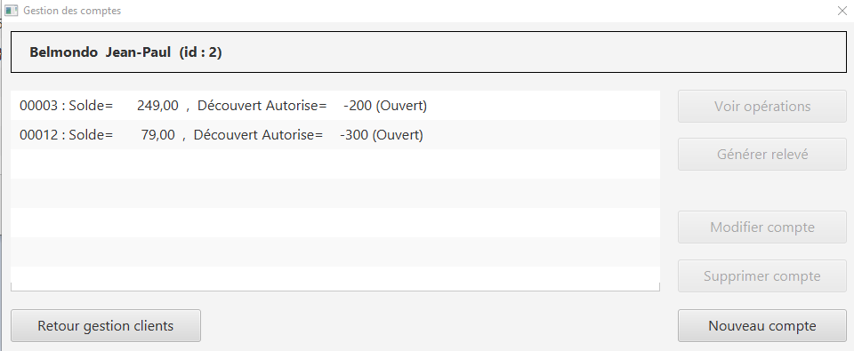
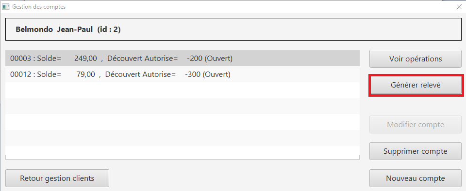
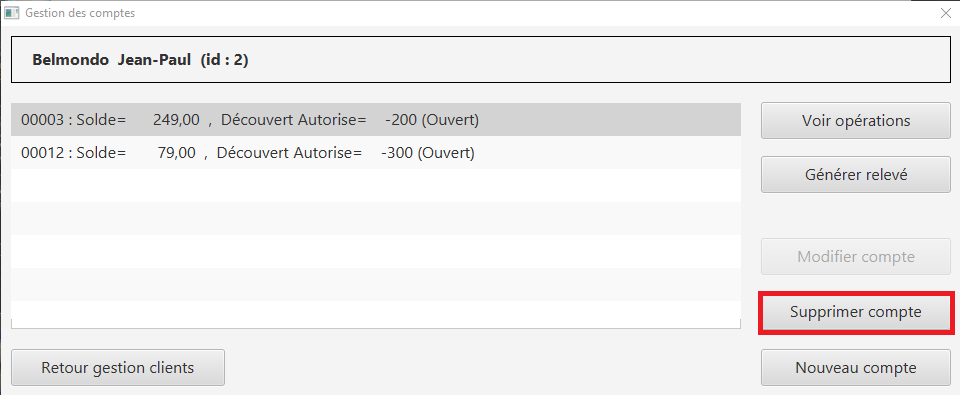
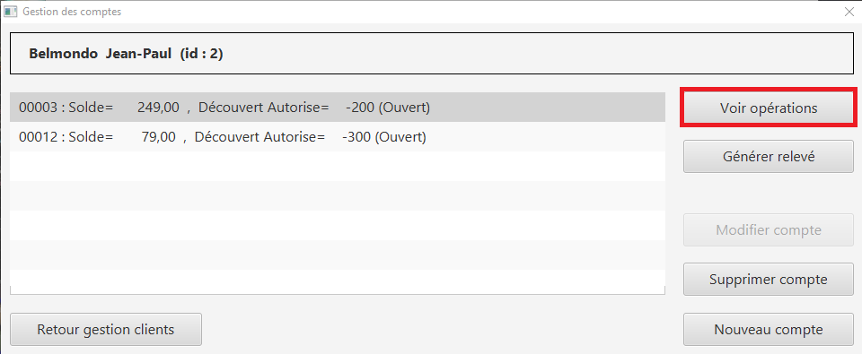
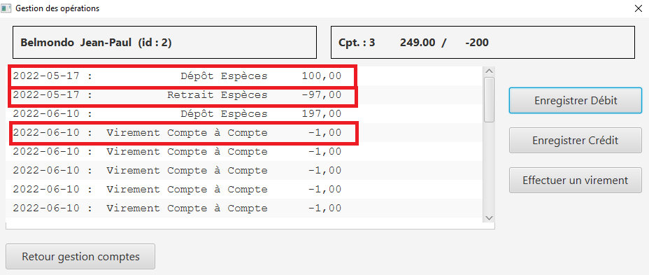
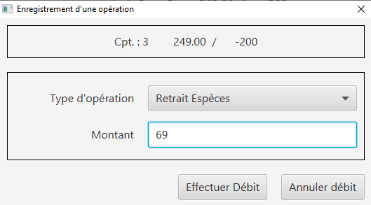
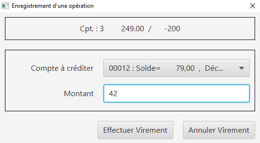
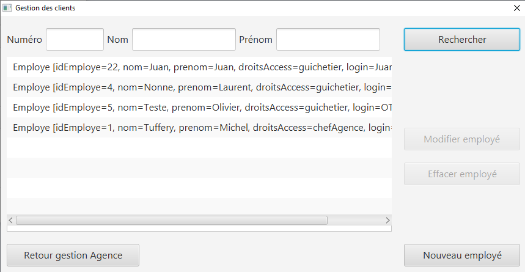
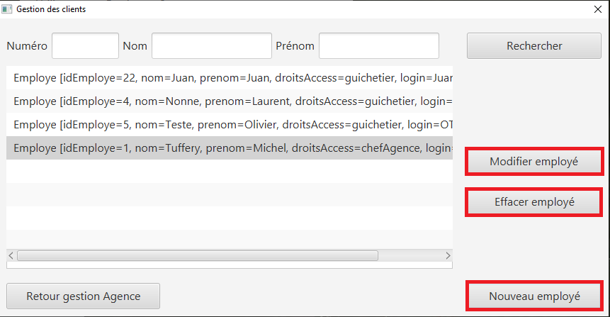

:toc:
:toc-title: Sommaire

= Documentation utilisateur V1

Adriel Marchant, Marco Valle, Elvis Pichou 

Groupe 1A

BUT Informatique, Iut de Blagnac

image::../img/Logo_IUT_Blagnac.png[Logo IUT, 300,150]

== Présentation générale de l'application 

L'application DailyBank est un outil de banque en ligne qui est déjà existant mais qui est maintenant obsolète c'est pour cela qu'une nouvelle version de cette application est en développement avec des ajouts de fonctionnalités ainsi que des amélioration de l'expérience utilisateur tel que l'ergonomie, la fiabilité et que l'application soit sûre.

== Rôle de l'application 

L'application de banque en ligne DailyBank est la jonction entre l'utilisateur et la banque pour ce faire elle doit permettre une communication fluide sans friction et simple d'utilisation pour les clients ainsi que pour les employés de la banque 

== Installation utilisation 

L'utilisation d'une application se doit simple c'est pour cela que l'application DailyBank est installable en quelques étapes seulement.

Il suffit à l'utilisateur de se rendre sur le site de la banque DailyBank, il devra ensuite se rendre sur la section Téléchargement et télécharger le fichier DailyBank.jar.

Une fois téléchargé le fichier peut être ouvert et de là, l'utilisateur n'a qu'a se connecté est accède directement à l'application.

== Fonctionnement

Au lancement de l'application l'utilisateur arrive sur la page principale, il ne peut rient faire a par se connecter, voir la fênetre d'aide ou quitter l'application.

image::../img/fenetre_principale_application.png[fenetre main,600,400]

Pour se connecter, l'utilisateur devra appuyer sur le bouton connexion ou dans la barre de menu l'option connnexion. Une fois le bon nom d'utilisateur et le bon mot de passe rentrés l'utilisateur se connectera à son compte.
 
=== Se connecter à un compte 

image::../img/connexion_application.png[fenetre main connexion,600,400]

image::../img/identification_application.png[fenetre identification,600,400]

Une fois connecté, l'utilisateur pourra voir les information sur son agence bancaire ainsi que ses employés, Une option dans le menu Gestion sera dégrisée ainsi que l'option de se déconnecter
 
=== Se déconnnecter d'un compte 

Dans le menu de gestion, l'utilisateur est confronté à plusieurs option, il peut tout d'abord retourner à la fenêtre d'accueil, il peut rechercher des client grâce à leurs numéro, nom ou prénom.

image::../img/gestion.png[fenetre gestion,600,400]

=== Voir les comptes courants du client 

=== Générer un relevé des information du compte 

=== Supprimer un des comptes 

=== Créer un compte courant 

image::../img/creer_compte.png[fenetre comptes creer,600,400]

image::../img/creer.png[fenetre creer,600,400]

=== voir les opération ainsi que l'historique du compte.

=== voir l'historique des opérations sur le compte ( dépôts , retraits et virements )

=== faire des débits, crédits et des virements vers un compte courant lui appartenant 

image::../img/operations_DCV.png[fenetre comptes débits crédits virement,600,400]

=== Débit en espèces ou en carte bleue

=== Crédit en espèce ou en carte bleue

image::../img/credit.png[fenetre credit,600,400]

=== Virement d'un compte à un autre 

A présent nous allons nous pencher sur le côté gestion des employés, certains utilisateur peuvent être des chefs d'agences et donc il peuvent gérer des employés. Tout d'abord il auront accès au bouton employés dans le menu gestion qui est grisé pour les utilisateurs normaux

=== Gestion employés

image::../img/gestion_employés.png[fenetre menu employés,600,400]

=== le chef d'agence à l'option de modifier un employé, de l'effacer ou d'en créer un nouveau 

image::../img/modifier_employe.png[fenetre modifier employés,600,400]

